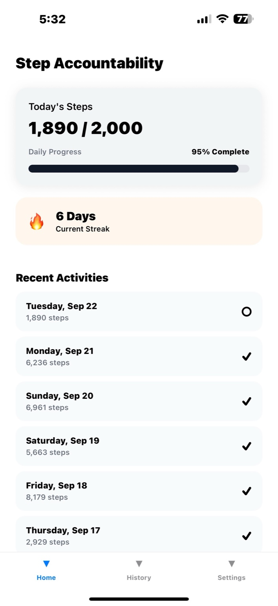
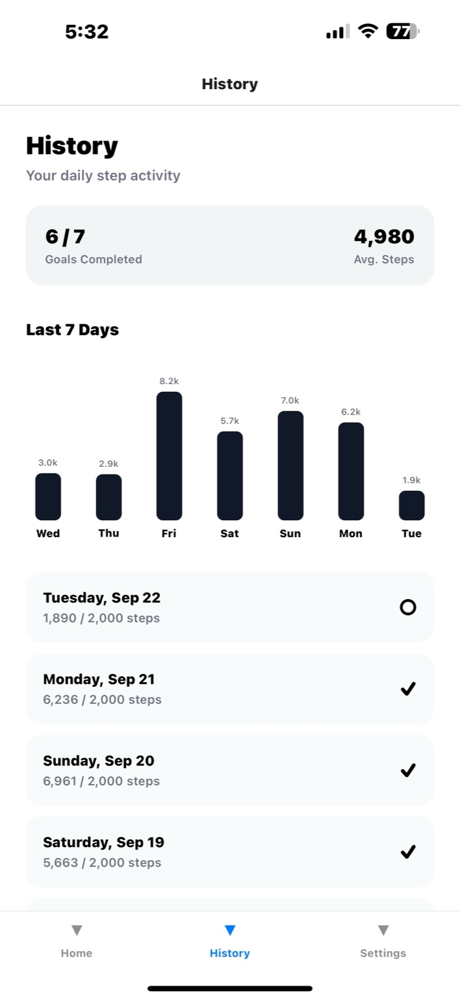
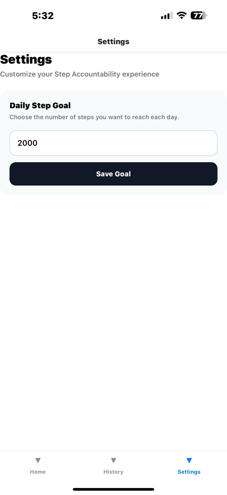
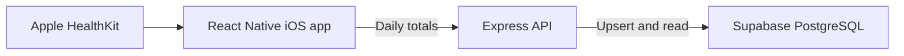

# Step Accountability

A personal iOS app for tracking daily steps against a goal. It reads step counts from Apple HealthKit, sends daily totals to a Node.js/Express API, and stores activity in Supabase PostgreSQL.

**Stack:** React Native, TypeScript, HealthKit, Notifee, Node.js, Express, Supabase/PostgreSQL.

## What it does

- **Home:** today's steps and progress, current streak, and recent activity.
- **History:** a seven-day bar chart, average steps, completed-goal count, and saved daily entries.
- **Settings:** set a daily step goal that persists on the device. The current goal is used to evaluate past days in the app.
- **Sync:** read HealthKit step samples and upload totals for the latest seven calendar days when Home starts or the app becomes active.
- **Reminder:** schedule a repeating local notification for 8 p.m.

The app is built for one person on an iPhone. It has no social features or App Store release.

## Screenshots

Screenshots from the working iPhone build with a 2,000-step goal:

| Home | History | Settings |
| --- | --- | --- |
|  |  |  |

## How it works



Home requests permission to read step counts, sums the samples for each of the last seven local calendar days, and sends each day's date, total, and goal to `PUT /api/steps/:date`. The API upserts into `daily_steps`; `GET /api/steps` returns saved activity for Home and History. The backend preserves a previously saved goal for older rows, while the app uses the **current** goal when displaying checkmarks and calculating streaks. The goal itself is stored locally with AsyncStorage.

## Run locally

You need macOS, Xcode, CocoaPods, Node.js 22.11 or newer, a Supabase project, and an iPhone with Health step data. HealthKit reads need a supported iOS device and permission.

### 1. Database and backend

Create a `daily_steps` table in your Supabase project if you do not already have one. The API expects a unique `date` and the following columns:

```sql
create table if not exists public.daily_steps (
  date date primary key,
  steps integer not null check (steps >= 0),
  goal integer not null check (goal > 0),
  synced_at timestamptz not null default now()
);
```

In `backend`, create a local `.env` file with `SUPABASE_URL` and `SUPABASE_SECRET_KEY` from your project. The root `.gitignore` excludes `.env`; never commit the secret key. Then run:

```bash
cd backend
npm ci
npm run dev
```

The API exposes `GET /api/health`, `GET /api/steps`, and `PUT /api/steps/:date`. It uses port 3000 locally unless `PORT` is set.

### 2. iOS app

Set `API_BASE_URL` in `mobile/src/config/api.ts` to the backend you want to use. For a physical iPhone connecting to your Mac's local backend, use your Mac's LAN IP address and port 3000; `localhost` on the phone points to the phone itself. Keep the phone and Mac on the same network.

```bash
cd mobile
npm ci
cd ios
bundle install
bundle exec pod install
cd ..
npm start
```

Open `mobile/ios/StepAccountability.xcworkspace` in Xcode, select your signing team and iPhone, then build and run. Grant Health step access and notification permission when prompted.

## Checks

From `mobile`, run:

```bash
npm test -- --runInBand --watch=false
npm run lint
npx tsc --noEmit
```

The test suite covers streak calculations (including missing days and an incomplete current day) and tab registration. The backend currently has no automated endpoint tests.

## Current limitations

- Sync covers only the latest seven days; an older gap is not backfilled.
- The reminder is fixed at 8 p.m. and does not check whether the daily goal is already complete.
- The existing API has **no user authentication**. A publicly reachable deployment should not be used for private activity data until access control is added. Local development and a demonstration on your own device do not require a public API.
- Goal changes apply to the app's current evaluation of past days; they do not rewrite every historical goal stored in the database.
